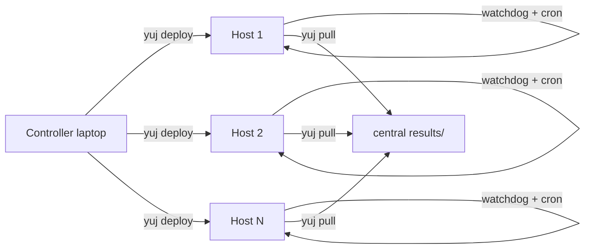

# yuj

**yuj**: assemble borrowed machines into a long-running batch.

---

## What it does



0. **`yuj provision`** *(optional)*: if you only have an admin/sudo login, create a dedicated worker user with key auth and save its credentials
1. **`yuj bootstrap`**: install Python or R on each host (no root)
2. **`yuj deploy`**: rsync your code + data to `$HOME` on each host
3. **`yuj submit`**: start a watchdog + cron; hosts keep working even if your laptop reboots
4. **`yuj status`**: dashboard: producing · idle · stalled · down
5. **`yuj pull`**: pull results back as they arrive
6. **`yuj decommission`**: remove the job and hand machines back clean

`yuj` scatters work across idle lab desktops over SSH and pulls the results back. A self-healing watchdog on each host keeps the batch running through crashes and reboots, so you don't need root on the machines or a scheduler watching over them.

---

## Quick start

::::{tab-set}

:::{tab-item} Python
```bash
pipx install yuj
mkdir my-job && cd my-job
yuj init --template python              # scaffold worker.py + config
$EDITOR fleet.csv                       # add your hosts
yuj bootstrap                           # install Python (uv) on hosts
yuj run                                 # deploy + start watchdog
yuj status                              # see who's producing
yuj pull                                # gather results (re-run any time)
```
:::

:::{tab-item} R
```bash
pipx install yuj
mkdir my-r-job && cd my-r-job
yuj init --template r                   # scaffold worker.R + environment.yaml
$EDITOR fleet.csv
yuj bootstrap                           # install R via micromamba (no root)
yuj run
yuj status --watch 30
yuj pull
```
:::

:::{tab-item} Any language
```bash
pipx install yuj
mkdir my-job && cd my-job
yuj init --template bare                # minimal scaffold
$EDITOR fleet.csv worker.sh             # your worker in any language
yuj run
yuj status
yuj pull
```
:::

::::

```{toctree}
:caption: Getting started
:hidden:

install
quickstart
```

```{toctree}
:caption: Guides
:hidden:

r-users
```

```{toctree}
:caption: Reference
:hidden:

cli
concepts
caveats
```
