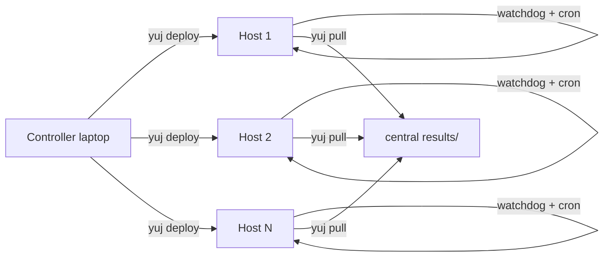

# yuj

**yuj** *(Sanskrit: "to yoke", root of yoga)*: yoke borrowed machines to a long-running batch.

`yuj` scatters work across idle lab desktops over SSH and pulls results back, with a self-healing watchdog on each host. No daemons, no cluster admin, no root; it runs on SSH, cron, and rsync.

---

## When to use yuj

| You have… | Use… |
|-----------|------|
| Real HPC + cluster admin, can install daemons | **HTCondor** |
| Short jobs, controller stays up | **GNU Parallel** (`--sshlogin`) |
| Borrowed desktops, days-long batches, reboots + fail2ban | **yuj** |

yuj exists for the case where you can't install software on every node and can't run a central scheduler, but you do have SSH access and write access to `$HOME`.

It only fits work you can split into independent items: each item runs on one host on its own, with no communication between items and no shared memory. If your job needs nodes to talk to each other mid-run (MPI, a shared address space), yuj is the wrong tool.

---

## What it does



0. **`yuj provision`** *(optional)*: if you only have an admin/sudo login, create a dedicated worker user with key auth and save its credentials
1. **`yuj bootstrap`**: install Python or R on each host (no root)
2. **`yuj deploy`**: rsync your code + data to `$HOME` on each host
3. **`yuj submit`**: start a watchdog + cron; hosts keep working even if your laptop reboots
4. **`yuj status`**: dashboard: producing · idle · stalled · down
5. **`yuj pull`**: pull results back as they arrive
6. **`yuj decommission`**: remove the job and hand machines back clean

---

## Quick start

=== "Python"

    ```bash
    pipx install yuj
    mkdir my-job && cd my-job
    yuj init --template python              # scaffold worker.py + config
    $EDITOR fleet.csv                       # add your hosts
    yuj bootstrap                           # install Python (uv) on hosts
    yuj deploy && yuj submit                # push code, start watchdog
    yuj status                              # see who's producing
    yuj pull --loop 60                      # gather results
    ```

=== "R"

    ```bash
    pipx install yuj
    mkdir my-r-job && cd my-r-job
    yuj init --template r                   # scaffold worker.R + environment.yaml
    $EDITOR fleet.csv
    yuj bootstrap                           # install R via micromamba (no root)
    yuj deploy && yuj submit
    yuj status --watch 30
    yuj pull --loop 60
    ```

=== "Any language"

    ```bash
    pipx install yuj
    mkdir my-job && cd my-job
    yuj init --template bare                # minimal scaffold
    $EDITOR fleet.csv worker.sh             # your worker in any language
    yuj deploy && yuj submit
    yuj status
    yuj pull
    ```
